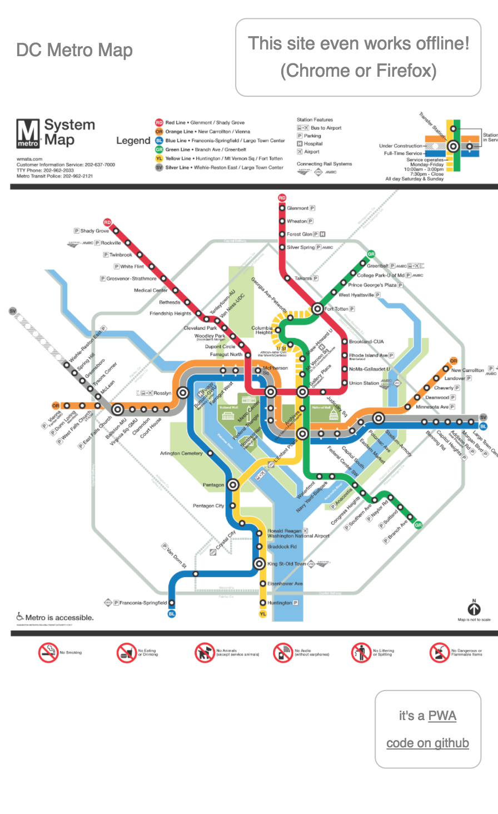

# dcmetromap

This is a Progressive Web application

It's basically an "offline application" that just contains an image of the DC Metro Map.

The web page gets cached offline, and it offers for you to add a shortcut to your home screen so it looks like an application you get from the app store.

I used this guide to get started with PWAs in Ember:
https://madhatted.com/2017/6/16/building-a-progressive-web-app-with-ember

I'm not using any particular Ember features except the PWA tools, but I have to say - it was super easy. This whole thing took me an hour to build and an hour to get deployed properly.

To run it locally, currently you have to comment out the https redirect code in `application.hbs` (unless you have a certificate locally).

## Prerequisites

You will need the following things properly installed on your computer.

* [Git](https://git-scm.com/)
* [Node.js](https://nodejs.org/) (with NPM)
* [Ember CLI](https://ember-cli.com/)
* [PhantomJS](http://phantomjs.org/)

## Installation

* `git clone <repository-url>` this repository
* `cd dcmetromap`
* `npm install`

## Running / Development

* `ember serve`
* Visit your app at [http://localhost:4200](http://localhost:4200).

### Code Generators

Make use of the many generators for code, try `ember help generate` for more details

### Running Tests

* `ember test`
* `ember test --server`

### Building

* `ember build` (development)
* `ember build --environment production` (production)

### Deploying

Specify what it takes to deploy your app.

## Further Reading / Useful Links

* [ember.js](http://emberjs.com/)
* [ember-cli](https://ember-cli.com/)
* Development Browser Extensions
  * [ember inspector for chrome](https://chrome.google.com/webstore/detail/ember-inspector/bmdblncegkenkacieihfhpjfppoconhi)
  * [ember inspector for firefox](https://addons.mozilla.org/en-US/firefox/addon/ember-inspector/)
